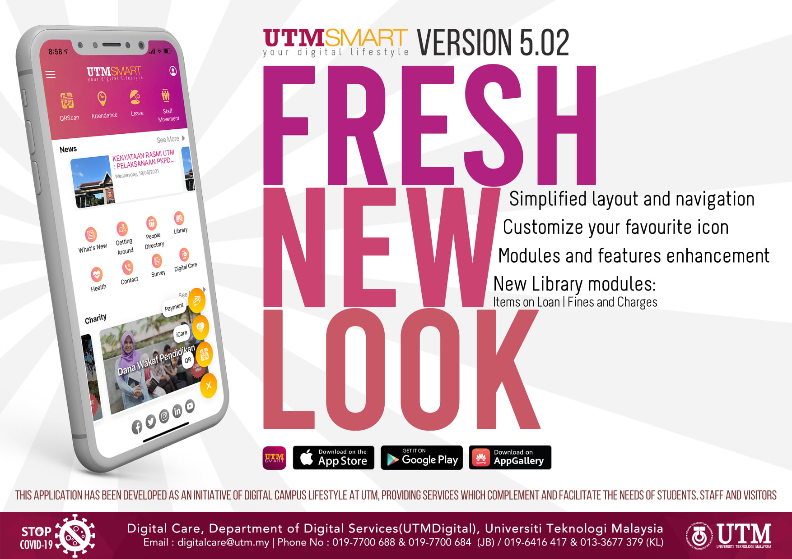

# Case Study 1: UTMSmart: Revolutionizing Campus Life Through Digital Innovation

    

The **UTMSmart** application is a comprehensive digital platform developed as part of Universiti Teknologi Malaysia’s (UTM) vision for a connected, tech-enabled campus ecosystem. It serves as a central resource to streamline essential services, supporting the dynamic needs of UTM’s students, faculty, and visitors by facilitating easy access to key campus functions, enhancing the overall campus experience.

| **Category** | **Description** |
|--------------|----------------|
| [Agile Concept: UTMSmart](https://drive.google.com/file/d/1B6AX646-zXVLZwstzDatENmk05u1Hegu/view?usp=sharing) | Agile concept implementation in UTMSmart. |

### Key Objectives of UTMSmart
UTMSmart was created to align with UTM’s digital transformation goals, fostering a “smart campus” lifestyle by offering:
- **Unified Access to Campus Services:** The application integrates a range of services, making it easier for students and staff to stay updated on campus activities, manage academic schedules, and access campus resources.
- **Convenience for Campus Community and Visitors:** With a user-friendly interface, UTMSmart aims to simplify campus navigation and offer information and support to visitors.

### Agile Development Methodology
The development of UTMSmart adheres to the Agile Scrum framework, known for its iterative and flexible approach, promoting regular communication and incremental improvements. Here’s a closer look at how the Agile methodology supports UTMSmart’s development:

1. **Daily Stand-Up Meetings:** Short, focused meetings where the team aligns on tasks, discusses progress, and addresses challenges, fostering teamwork and quick problem-solving.
2. **Agile Board Management:** An agile board keeps the development process organized, providing a visual representation of tasks, priorities, and ongoing progress.
3. **User Feedback Integration:** The application is user-centric, with continuous input from the campus community to ensure features are practical and responsive to user needs.

### Development Team Structure
The UTMSmart team is structured to ensure clear roles and responsibilities, enabling efficient development cycles:
- **Scrum Master & Solution Designer (Azmi):** Responsible for managing the Scrum framework, removing obstacles, and ensuring the solution aligns with project goals.
- **Lead Developer (Syafiq):** Oversees the technical direction and ensures that coding standards and quality are met.
- **Developers (Siti Hajar, Fadzli, Shahrul Amir):** Handle both frontend and backend development, focusing on creating and refining application features.

### Technology Stack
A robust set of tools supports the development and maintenance of UTMSmart, ensuring seamless collaboration, effective version control, and efficient project management:
- **Agile Tool:** ClickUp, which supports task allocation and progress tracking.
- **Integration Tool:** Git, enabling version control and streamlined updates.
- **Collaboration Tool:** Telegram, used for quick communication within the team.
- **DevOps and Development Tools:** A range of technologies facilitate the deployment, testing, and iteration processes critical to maintaining a high-quality application.

### Project Timeline and Version Rollout
Since its inception in March 2018, UTMSmart has followed a structured timeline with periodic version releases, demonstrating a commitment to consistent upgrades and user-driven enhancements. Key developments include:
- **Initial Release and Early Sprints:** The first version was launched following an intensive initial sprint, with subsequent sprints dedicated to refining core functionalities.
- **Version Progressions:** Major updates like Versions 3.0 and 4.0 introduced new modules and enhanced functionalities to meet evolving user needs. Each version rollout was strategically planned, with clear sprint objectives, ensuring each new release added value to the platform.
- **Consultation and Support Periods:** Between sprints, the team engages in user consultations, gathering feedback and making adjustments as needed to maintain a high standard of usability and relevance.

### Current Application Scope and Usage Statistics
The UTMSmart application, through its intuitive design and useful features, has achieved considerable adoption within the UTM community. Here are some highlights from the recent usage statistics:
- **User Distribution by Platform:** Android remains the most popular platform, with over 23,000 users in October, while iOS and Huawei have shown steady monthly growth.
- **Steady Increase in Engagement:** Usage metrics reflect a growing engagement month over month, signaling that the application is meeting user needs effectively and becoming integral to the daily routines of students and staff.

### Conclusion
UTMSmart stands as a significant milestone in UTM’s digital transformation journey. By continually enhancing features and expanding its service offerings, UTMSmart embodies the future-ready vision of a digital campus, enabling students, faculty, and visitors to connect seamlessly with the university’s resources and each other. As the application continues to evolve, UTMSmart is well-positioned to support the demands of a growing user base while driving forward UTM’s mission to cultivate a technologically empowered educational environment.

## Contribution 🛠️
Please create an [Issue](https://github.com/drshahizan/project-management/issues) for any improvements, suggestions or errors in the content.

