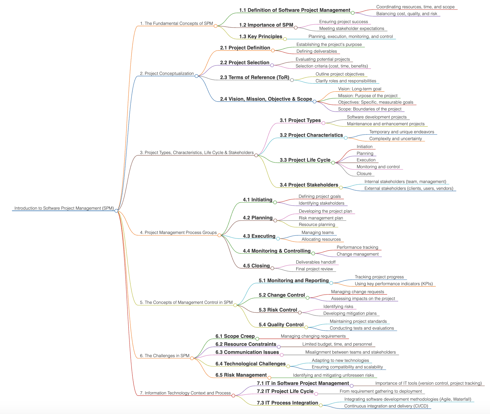

# Introduction to Software Project Management (SPM)

  

## The Fundamental Concepts of SPM
Software Project Management (SPM) refers to the process of planning, executing, and overseeing software development projects. It involves applying project management principles specifically to software projects to ensure their successful completion within scope, time, and budget. SPM focuses on achieving project objectives while managing resources, risks, and stakeholder expectations.

## Project Conceptualization: Project Definition, Selection, ToR, Vision, Mission, Objective & Scope
- **Project Definition**: Clarifying the problem to be solved and the solution to be delivered.
- **Project Selection**: Choosing a project based on its strategic alignment, value, and feasibility.
- **Terms of Reference (ToR)**: Outlining the key responsibilities, deliverables, and timelines for the project.
- **Vision & Mission**: Establishing the overall purpose (vision) and approach (mission) of the project.
- **Objectives**: Defining specific, measurable goals to be achieved.
- **Scope**: Identifying the boundaries of the project, including deliverables, resources, and constraints.

## Project Types, Characteristics, Life Cycle & Stakeholders
- **Project Types**: Projects vary from software development to implementation, enhancement, and maintenance. Each type has distinct characteristics in terms of complexity, requirements, and resources.
- **Characteristics**: Software projects are typically intangible, flexible, and iterative. They often require continuous feedback and adaptation.
- **Life Cycle**: Projects progress through distinct phases: initiation, planning, execution, monitoring & control, and closure.
- **Stakeholders**: Individuals or groups who are affected by or have an interest in the project, including clients, end users, team members, and sponsors.

## Project Management Process Groups
1. **Initiation**: Defining the project at a high level and securing approval to proceed.
2. **Planning**: Developing a detailed plan that outlines how the project will be executed, monitored, and controlled.
3. **Execution**: Coordinating people and resources to carry out the project plan.
4. **Monitoring & Controlling**: Tracking project performance to ensure that objectives are met and making necessary adjustments.
5. **Closing**: Finalizing all project activities, delivering the final product, and formally closing the project.

## The Concepts of Management Control in SPM
Management control in SPM involves ensuring that the project stays aligned with its goals through continuous tracking, measuring, and adjusting of progress. This includes:
- **Scope Control**: Preventing scope creep by managing changes to the project scope.
- **Cost Control**: Monitoring expenditures to keep the project within its budget.
- **Schedule Control**: Managing timelines and ensuring that milestones are met.
- **Quality Control**: Ensuring that the project's outputs meet the required standards.

## The Challenges in SPM
Software projects often face unique challenges such as:
- **Scope Creep**: Uncontrolled changes or expansions in the project scope.
- **Changing Requirements**: The dynamic nature of software development can lead to evolving project requirements.
- **Resource Allocation**: Balancing the availability of skilled resources with project demands.
- **Risk Management**: Identifying and mitigating risks associated with technology, team dynamics, and external factors.
- **Communication Issues**: Ensuring effective communication among stakeholders from diverse backgrounds.

## Information Technology Context and Process
SPM must be aligned with the IT context in which it operates, including:
- **Technology Selection**: Choosing the appropriate technology stack to support the project's goals.
- **Development Methodologies**: Adopting methodologies such as Agile, Waterfall, or DevOps to guide the development process.
- **IT Governance**: Ensuring that the project adheres to organizational policies, standards, and regulatory requirements.
- **Process Integration**: Seamlessly integrating the project with other IT systems and processes to ensure smooth operation and delivery.

## Useful Materials

| No. | Topic | Website |
|-----|-------|---------|
| 1. | **The Fundamental Concepts of SPM** | [Javatpoint - Software Project Management](https://www.javatpoint.com/software-project-management) |
|     |       | [TutorialsPoint - Software Project Management](https://www.tutorialspoint.com/software_engineering/software_project_management.htm) |
|     |       | [GeeksforGeeks - Software Project Management](https://www.geeksforgeeks.org/software-engineering-software-project-management-spm/) |
|     |       | [Holistique Training - Supplier Performance Management](https://www.holistiquetraining.com/en/news/what-is-supplier-performance-management) |
|     |       | [Springer - Sequential Pattern Mining](https://link.springer.com/article/10.1007/s41060-024-00659-x) |
| 2. | **Project Conceptualization: Project Definition, Selection, ToR, Vision, Mission, Objective & Scope** | [McGraw Hill Education - Introduction to Software Project Management](https://highered.mheducation.com/sites/dl/free/007709834x/46260/ch01.pdf) |
|     |       | [Fiveable - Project Conceptualization](https://library.fiveable.me/key-terms/creative-producing-i/project-conceptualization) |
|     |       | [The Digital Project Manager - Project Scope](https://thedigitalprojectmanager.com/projects/scope-management/what-is-project-scope/) |
|     |       | [PMI - Vision, Strategy, Objectives](https://www.pmi.org/learning/library/discussing-ultimate-management-model-9903) |
|     |       | [Project Management Institute - Developing a complete project scope statement in 2 days](https://www.pmi.org/learning/library/project-scope-statement-skills-tools-7981) |
| 3. | **Project Types, Characteristics, Life Cycle & Stakeholders** | [Resource Guru - Project Life Cycle](https://resourceguruapp.com/blog/project-management/project-life-cycle) |
|     |       | [The Digital Project Manager - Project Life Cycle](https://thedigitalprojectmanager.com/projects/pm-methodology/project-management-life-cycle/) |
|     |       | [Springer - Project Life Cycles](https://link.springer.com/chapter/10.1007/978-981-10-6992-5_2) |
|     |       | [Invensis Learning - Project Management Life Cycle](https://www.invensislearning.com/blog/5-phases-project-management-lifecycle/) |
|     |       | [Project Management Institute - Project Life Cycle](https://www.pmi.org/about/what-is-a-project) |
| 4. | **Project Management Process Groups** | [Project Management Academy - Process Groups](https://projectmanagementacademy.net/articles/five-traditional-process-groups/) |
|     |       | [ProjectManager - Process Groups](https://www.projectmanager.com/blog/project-management-process-groups) |
|     |       | [Management.org - Project Management Phases](https://management.org/project-management-phases) |
|     |       | [PMI - Process Groups](https://www.pmi.org/standards/process-groups) |
|     |       | [The Five Traditional Process Groups Explained](https://projectmanagementacademy.net/articles/five-traditional-process-groups/) |
| 5. | **The Concepts of Management Control in SPM** | [SPM Book - Execution, Monitoring, and Control](https://www.spmbook.com/downloads/slides/pdf/C03.08-09-ExecutionMonitoringControl.key.pdf) |
|     |       | [Springer - Strategic Management Control](https://link.springer.com/chapter/10.1007/978-3-030-38640-5_1) |
|     |       | [Marketing91 - Management Control](https://www.marketing91.com/management-control/) |
|     |       | [Springer - Evolution of Management Control](https://link.springer.com/chapter/10.1007/978-3-642-36684-0_2) |
|     |       | [GeeksforGeeks - Management in SPM](https://www.geeksforgeeks.org/software-engineering-software-project-management-spm/) |
| 6. | **The Challenges in SPM** | [Showell - Overcoming Challenges in SPM](https://www.showell.com/resources/overcoming-challenges-in-sales-performance-management) |
|     |       | [Neocol - Addressing SPM Challenges](https://neocol.com/addressing-spm-challenges-salesforce-solutions-explored/) |
|     |       | [GeeksforGeeks - Challenges in SPM](https://www.geeksforgeeks.org/software-engineering-software-project-management-spm/) |
|     |       | [Uppwise - Challenges in Strategic Portfolio Management](https://www.uppwise.com/2022/12/26/challenges-strategic-portfolio-management/) |
|     |       | [OpenSymmetry - SPM Challenges](https://www.opensymmetry.com/resources/whitepapers/spm-challenges-technology-for-financial-services-part-one/) |
| 7. | **Information Technology Context and Process** | [University of Cincinnati - What Is Information Technology?](https://online.uc.edu/blog/what-is-information-technology/) |
|     |       | [ProjectManager - IT Project Management](https://www.projectmanager.com/guides/it-project-management) |
|     |       | [Coursera - Information Technology Guide](https://www.coursera.org/articles/what-is-information-technology) |
|     |       | [Cloudavize - Information Technology](https://www.cloudavize.com/information-technology/) |
|     |       | [Coursera - Information Systems vs. Information Technology](https://www.coursera.org/articles/information-systems-vs-information-technology) |

## Contribution 🛠️
Please create an [Issue](https://github.com/drshahizan/project-management/issues) for any improvements, suggestions or errors in the content.

