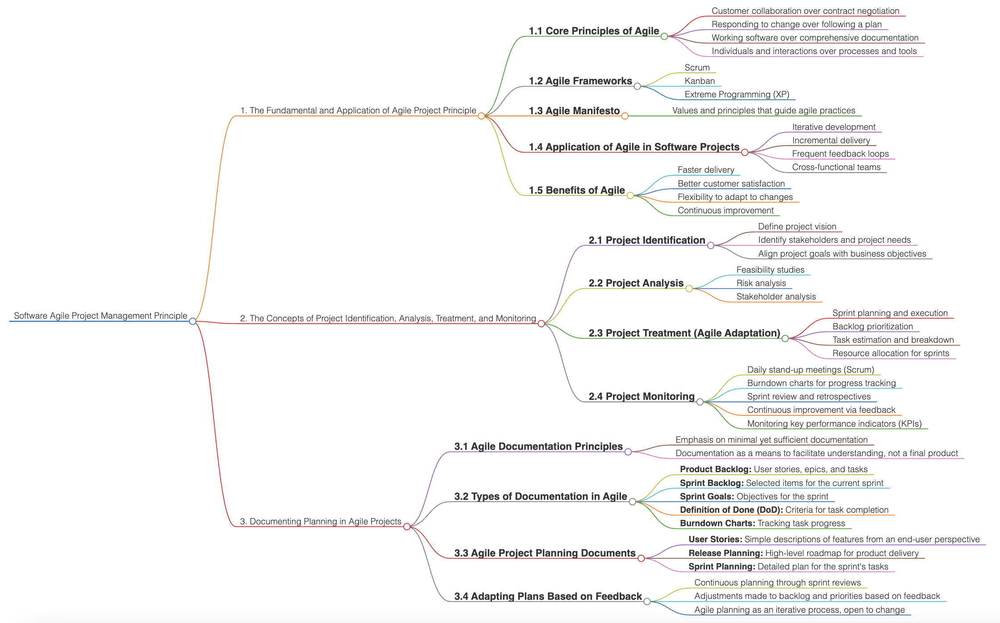

# Software Agile Project Management Principle

  

Agile Project Management has become a cornerstone in the software industry, enabling teams to adapt quickly, deliver consistently, and foster collaborative environments that place the customer at the center of the development process. This approach to project management is not only about flexible planning and iterative progress but also about maintaining a continuous improvement mindset. This document provides a comprehensive overview of Agile principles, methodologies, project handling processes, and documentation practices essential for effective Agile Project Management.

### 1. The Fundamentals and Application of Agile Project Principle

Agile Project Management begins with understanding and applying its core principles, structured frameworks, and a strong commitment to the Agile Manifesto. This foundation enables teams to operate effectively within an Agile environment, fostering efficiency, innovation, and customer satisfaction.

#### 1.1 Core Principles of Agile
The core principles of Agile emphasize a shift from traditional project management by prioritizing collaboration, adaptability, and delivering tangible results over process formalities. Key principles include:
- **Customer Collaboration over Contract Negotiation**: Engaging with customers continuously to align with their evolving needs.
- **Responding to Change over Following a Plan**: Flexibility to adapt as project requirements shift.
- **Working Software over Comprehensive Documentation**: Delivering functional software frequently to demonstrate progress.
- **Individuals and Interactions over Processes and Tools**: Prioritizing communication and teamwork over strict processes.

#### 1.2 Agile Frameworks
Agile encompasses several frameworks that provide structured approaches to implementing Agile principles in projects. Prominent frameworks include:
- **Scrum**: Focuses on iterative development with sprints, daily stand-ups, and regular sprint reviews.
- **Kanban**: Visualizes tasks on a board, optimizing workflow and managing workload limits.
- **Extreme Programming (XP)**: Emphasizes technical excellence and continuous feedback, focusing on code quality and customer collaboration.

#### 1.3 Agile Manifesto
The Agile Manifesto, established in 2001, outlines the values and principles guiding Agile practices:
- **Iterative Development**: Building software in small, manageable increments.
- **Incremental Delivery**: Releasing parts of the product in stages for feedback and improvement.
- **Frequent Feedback Loops**: Gaining insights from users regularly to guide future development.
- **Cross-Functional Teams**: Empowering teams with diverse skills to work together effectively.

#### 1.4 Application of Agile in Software Projects
Agile is widely adopted in software projects for its practical benefits:
- **Faster Delivery**: Short development cycles enable quicker releases.
- **Better Customer Satisfaction**: Ongoing feedback and improvements ensure the product meets customer needs.
- **Flexibility to Adapt to Changes**: Agile’s adaptability allows for changes without significant project disruption.
- **Continuous Improvement**: Agile promotes regular evaluation and enhancement of processes and products.

#### 1.5 Benefits of Agile
The benefits of Agile span across team dynamics, project adaptability, and overall outcomes:
- **Faster delivery** through iterative development cycles.
- **Enhanced customer satisfaction** with responsive changes.
- **Increased flexibility** and adaptability to evolving requirements.
- **Sustained continuous improvement** through regular feedback and adaptation.

### 2. The Concepts of Project Identification, Analysis, Treatment, and Monitoring

A successful Agile project is underpinned by careful planning and continuous monitoring. Agile project phases include identifying project scope, analyzing requirements, implementing treatment (or adaptive strategies), and monitoring progress for ongoing improvement.

#### 2.1 Project Identification
Identifying a project’s vision, stakeholders, and objectives is the first step in Agile Project Management:
- **Define Project Vision**: Establish a clear vision for the project, aligning team goals with business needs.
- **Identify Stakeholders and Project Needs**: Recognize key stakeholders and assess their requirements to shape project outcomes.
- **Align Project Goals with Business Objectives**: Ensure project goals support broader organizational objectives.

#### 2.2 Project Analysis
Project analysis involves evaluating feasibility, risks, and stakeholder expectations:
- **Feasibility Studies**: Assess the project’s viability within available resources.
- **Risk Analysis**: Identify potential challenges and create mitigation strategies.
- **Stakeholder Analysis**: Evaluate stakeholder interests, expectations, and impact on the project.

#### 2.3 Project Treatment (Agile Adaptation)
Once the project vision is defined, Agile teams engage in adaptive practices to deliver high-value outcomes:
- **Sprint Planning and Execution**: Plan and execute tasks within each sprint, setting clear goals and expectations.
- **Backlog Prioritization**: Prioritize tasks based on customer feedback and business value.
- **Task Estimation and Breakdown**: Decompose tasks into manageable units with time estimates.
- **Resource Allocation for Sprints**: Ensure resources align with sprint goals for optimized efficiency.

#### 2.4 Project Monitoring
Effective monitoring is essential for continuous improvement and early issue detection:
- **Daily Stand-up Meetings (Scrum)**: Facilitate quick team check-ins to discuss progress and challenges.
- **Burndown Charts for Progress Tracking**: Visual tools to monitor task completion against the timeline.
- **Sprint Review and Retrospectives**: Reflect on sprint performance and identify areas for improvement.
- **Continuous Improvement via Feedback**: Incorporate feedback loops for ongoing refinement.
- **Monitoring Key Performance Indicators (KPIs)**: Track KPIs to gauge project health and alignment with objectives.

### 3. Documenting Planning in Agile Projects

Documentation in Agile is essential for maintaining transparency and ensuring team alignment. However, Agile documentation is intentionally lean, focusing on utility rather than formality.

#### 3.1 Agile Documentation Principles
Agile promotes documentation that facilitates understanding without being excessive:
- **Emphasis on Minimal yet Sufficient Documentation**: Provide only essential information to support the project.
- **Documentation as a Means to Facilitate Understanding, Not a Final Product**: Documentation should serve as a reference, not as the end goal.

#### 3.2 Types of Documentation in Agile
Agile projects utilize specific documents to support planning, tracking, and reporting:
- **Product Backlog**: A prioritized list of user stories, epics, and tasks.
- **Sprint Backlog**: Selected items scheduled for the current sprint.
- **Sprint Goals**: Defined objectives that the team aims to achieve during each sprint.
- **Definition of Done (DoD)**: Criteria that signify task completion.
- **Burndown Charts**: Graphs to track sprint progress against time.

#### 3.3 Agile Project Planning Documents
Effective Agile planning relies on streamlined documentation practices:
- **User Stories**: Concise feature descriptions from an end-user perspective.
- **Release Planning**: A high-level roadmap outlining goals for each product release.
- **Sprint Planning**: A detailed plan specifying tasks and objectives for the sprint.

#### 3.4 Adapting Plans Based on Feedback
In Agile, planning is a continuous process:
- **Continuous Planning through Sprint Reviews**: Regularly review and adjust plans based on sprint outcomes.
- **Adjustments Made to Backlogs and Priorities**: Realign tasks and priorities to reflect updated requirements.
- **Agile Planning as an Iterative Process, Open to Change**: Embrace flexibility to adapt project plans according to new information and feedback.

#### Case Study
| No | Title |
|--------------:|----------------|
| 1. | [UTMSmart: Revolutionizing Campus Life Through Digital Innovation](w2cs1.md) |
| 2. | [Implementing Agile Project Principles in Higher Education](w2cs2.md)|
| 3. | [Implementing Agile Project Principles in Spotify's Development](w2cs3.md)|
| 4. | [Applying Agile Project Principles in the Development of Microsoft Teams](w2cs4.md)|

#### Youtube
| No | Title |
|--------------:|----------------|
| 1. | [What Is Agile Methodology? Introduction to Agile Methodology in Six Minutes](https://youtu.be/8eVXTyIZ1Hs?si=L01R9k_F3nUhQmYT) |
| 2. | [What Is Agile? Agile Frameworks Explained](https://youtu.be/wmJfx7zAfQI?si=f6VFbZ24sbRKUVJ7) |
| 3. | [Agile Frameworks - Scrum, Kanban, Lean, XP, Crystal](https://youtu.be/WjwEh15M5Rw?si=P7z0YoGBUVLF4Ig8) |
| 4. | [Agile Management](https://youtu.be/km7n3DI5IWk?si=CJPneeTWyCE3rW6C) |
| 5. | [What is Scrum?](https://youtu.be/SG_iHptXcKQ?si=K8BCn_32yg2_zWsB) |
| 6. | [Agile and Scrum in the Real World](https://youtu.be/1evfn3qTYGM?si=6IOjezfqewvNONni) |
| 6. | [Scrum Master Tutorial](https://youtu.be/eYLf0z3Xhok?si=J265xfmIRd6U8ObF) |

### Conclusion

Software Agile Project Management Principles provide a robust framework for delivering high-quality products in dynamic environments. By focusing on core Agile values, structured frameworks, effective project handling, and flexible documentation practices, Agile enables teams to navigate uncertainty and deliver results that align with customer needs and business objectives. Agile’s adaptability and commitment to continuous improvement make it an ideal approach for software development in today’s fast-paced and innovation-driven landscape.

## Contribution 🛠️
Please create an [Issue](https://github.com/drshahizan/project-management/issues) for any improvements, suggestions or errors in the content.

