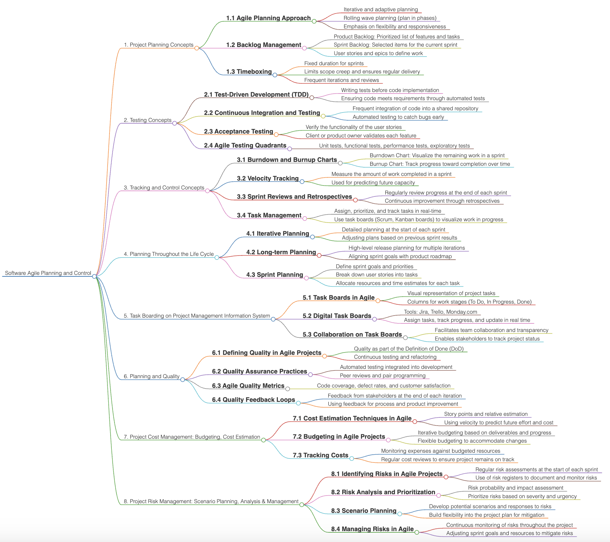

# Software Agile Planning and Control

  

# Detailed Analysis of "Software Agile Planning and Control" Mind Map

This mind map presents a comprehensive breakdown of key principles, methodologies, and tools used in **Software Agile Planning and Control**. Below is a professional, detailed elaboration of its components, categorized by sections.

---

## **1. Project Planning Concepts**

### **1.1 Agile Planning Approach**
- Agile planning emphasizes **iterative and adaptive approaches**, where plans evolve based on feedback and changing requirements.
- **Rolling wave planning** is applied, focusing on planning in phases rather than attempting to predict the entire project lifecycle upfront.
- Prioritization is placed on flexibility, responsiveness, and delivering customer value incrementally.

### **1.2 Backlog Management**
- **Product Backlog**:
  - A prioritized list of features and tasks that form the foundation for iterative development.
  - Continuously refined based on feedback and changing project needs.
- **Sprint Backlog**:
  - A subset of the product backlog selected for the current sprint.
  - Provides a focused view of what needs to be accomplished within a timebox.
- **User Stories and Epics**:
  - Used to define work. User stories are granular, task-level items, while epics represent larger objectives broken into smaller units.

### **1.3 Timeboxing**
- Sprints are **fixed-duration cycles** (typically 1–4 weeks) to maintain consistent delivery.
- Ensures scope is managed effectively by focusing on delivering specific objectives within each sprint.
- Encourages **frequent reviews and iterations** to refine features and address challenges early.

---

## **2. Testing Concepts**

### **2.1 Test-Driven Development (TDD)**
- A technique where tests are written **before writing code** to ensure code meets requirements.
- Automates testing processes to increase efficiency and reduce bugs.

### **2.2 Continuous Integration and Testing**
- Developers frequently integrate code into a **shared repository**.
- Automated testing is conducted during integration to detect issues early in the development cycle.

### **2.3 Acceptance Testing**
- Ensures that features meet the criteria defined by the **product owner or client**.
- Focused on validating the **functionality of user stories** and confirming alignment with business goals.

### **2.4 Agile Testing Quadrants**
- Provides a framework for **comprehensive testing**:
  1. **Unit Tests**: Verify individual components.
  2. **Functional Tests**: Check feature behavior.
  3. **Performance Tests**: Assess scalability and speed.
  4. **Exploratory Tests**: Uncover unexpected issues through creative, ad hoc testing.

---

## **3. Tracking and Control Concepts**

### **3.1 Burndown and Burnup Charts**
- **Burndown Chart**:
  - Visualizes the **remaining work** in a sprint.
  - Helps the team stay aligned with sprint goals and deadlines.
- **Burnup Chart**:
  - Tracks **progress towards overall completion** of tasks or goals over time.
  - Useful for visualizing scope changes.

### **3.2 Velocity Tracking**
- Tracks the **amount of work completed** during a sprint.
- Used as a metric to predict the team's capacity for future sprints.

### **3.3 Sprint Reviews and Retrospectives**
- **Sprint Reviews**:
  - Evaluate progress at the end of each sprint.
  - Include stakeholders to gather feedback and adjust deliverables.
- **Sprint Retrospectives**:
  - Focus on **process improvement** by identifying what worked and what didn’t.
  - Emphasizes continuous improvement.

### **3.4 Task Management**
- Agile teams assign, prioritize, and track tasks **in real-time**.
- Tools such as **Scrum boards** or **Kanban boards** provide a visual way to track work in progress and completed tasks.

---

## **4. Planning Throughout the Life Cycle**

### **4.1 Iterative Planning**
- Planning is done **at the start of each sprint**, allowing for frequent adjustments based on feedback and priorities.

### **4.2 Long-term Planning**
- Focuses on **high-level objectives** that align with the product roadmap.
- Plans for multiple iterations while maintaining flexibility.

### **4.3 Sprint Planning**
- Defines sprint-specific goals and **breaks user stories into actionable tasks**.
- Allocates resources efficiently to ensure that sprint timelines are met.

---

## **5. Task Boarding on Project Management Information System**

### **5.1 Task Boards in Agile**
- Visual tools that represent **project tasks across different stages** (e.g., To Do, In Progress, Done).
- Ensure that the team has a shared understanding of progress.

### **5.2 Digital Task Boards**
- Platforms like **Jira**, **Trello**, and **Monday.com** allow real-time tracking and collaboration.
- Key features include assigning tasks, updating statuses, and managing progress digitally.

### **5.3 Collaboration on Task Boards**
- Facilitates **cross-functional team collaboration**.
- Provides transparency for stakeholders, enabling them to stay informed about project status.

---

## **6. Planning and Quality**

### **6.1 Defining Quality in Agile Projects**
- Quality is established as part of the **Definition of Done (DoD)**.
- Continuous testing ensures that each increment meets the required standards.

### **6.2 Quality Assurance Practices**
- QA is integrated into the **development process** through continuous testing and code reviews.

### **6.3 Agile Quality Metrics**
- Common metrics include:
  - **Code coverage**: The extent to which the code is tested.
  - **Defect rates**: Number of bugs found in each sprint.
  - **Customer satisfaction**: User feedback on features delivered.

### **6.4 Quality Feedback Loops**
- Feedback from stakeholders is gathered **at the end of every sprint**.
- Used to fine-tune processes and improve product quality iteratively.

---

## **7. Project Cost Management: Budgeting, Cost Estimation**

### **7.1 Cost Estimation Techniques in Agile**
- Agile uses **relative estimation techniques** such as story points.
- Velocity is used to calculate the time and cost of future work.

### **7.2 Budgeting in Agile Projects**
- Agile budgeting is flexible, allowing for changes in scope or priorities.
- Helps to ensure alignment with business goals.

### **7.3 Tracking Costs**
- Regular cost reviews help to monitor and control expenses.
- Ensures the project stays within budget.

---

## **8. Project Risk Management: Scenario Planning, Analysis, and Management**

### **8.1 Identifying Risks in Agile Projects**
- Risks are assessed **at the start of each sprint**.
- Tools like risk registers are used to document and monitor risks.

### **8.2 Risk Analysis and Prioritization**
- Risks are analyzed based on their **probability** and **impact**.
- High-priority risks are addressed first to minimize disruption.

### **8.3 Scenario Planning**
- Involves preparing for **potential risks** by developing alternative plans.

### **8.4 Managing Risks in Agile**
- Risks are monitored continuously.
- Teams adjust sprint goals and allocate resources as necessary to mitigate identified risks.

## Contribution 🛠️
Please create an [Issue](https://github.com/drshahizan/project-management/issues) for any improvements, suggestions or errors in the content.

