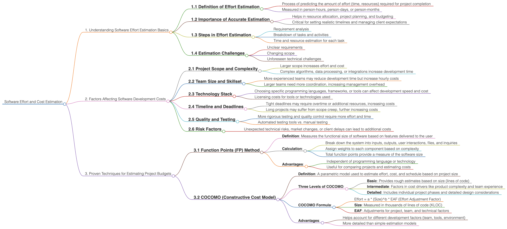

# Software Effort and Cost Estimation

  

## 1. Understanding Software Effort Estimation Basics

**1.1 Definition of Effort Estimation:**
- Effort estimation refers to the systematic process of predicting the amount of work, time, and resources required to complete a project successfully. It encompasses both qualitative and quantitative assessments to provide an accurate overview of what a project demands.
- Typically measured using various units such as person-hours, person-days, or person-months, effort estimation serves as a foundation for planning and execution.
- This process not only defines the scope of the work but also ensures that stakeholders have a realistic understanding of the project requirements and constraints.

**1.2 Importance of Accurate Estimation:**
- Accurate effort estimation is a cornerstone of effective project management, as it lays the groundwork for resource allocation, budget planning, and scheduling.
- By providing precise estimates, teams can allocate human and technical resources more efficiently, minimizing waste and avoiding bottlenecks.
- It plays a critical role in setting realistic project timelines, ensuring client satisfaction, and managing expectations effectively. Inaccurate estimates can lead to project delays, cost overruns, and potential conflicts among stakeholders.
- Additionally, accurate estimation helps in identifying potential risks early, allowing for better contingency planning.

**1.3 Steps in Effort Estimation:**
- **Requirement Analysis:** This initial step involves gathering and understanding all project requirements, ensuring that every aspect of the project is well-documented and agreed upon.
- **Task Breakdown:** Divide the project into smaller, manageable tasks and activities to simplify estimation and tracking.
- **Resource and Time Allocation:** For each task, determine the specific resources and time required, considering factors such as team expertise and technological dependencies.
- **Review and Validation:** Collaborate with stakeholders to validate the estimates and adjust for any overlooked factors or assumptions.

**1.4 Estimation Challenges:**
- **Unclear Requirements:** Ambiguous or incomplete requirements can lead to inaccurate estimates, necessitating frequent revisions and adjustments.
- **Changing Scope:** Scope creep, where new requirements are added during the project lifecycle, can significantly impact initial estimates and timelines.
- **Technical Uncertainties:** Unforeseen technical challenges, such as integration issues or performance bottlenecks, often lead to delays and increased costs.
- **Team Dynamics:** Variability in team performance, skill levels, and communication can further complicate the estimation process.
- **External Factors:** Market changes, client delays, or resource availability issues can introduce unexpected obstacles that impact overall effort and cost.

## 2. Factors Affecting Software Development Costs

**2.1 Project Scope and Complexity:**
- The broader the project scope, the greater the effort and cost required. Larger projects often involve multiple phases, increased coordination, and more extensive testing.
- Complexity, such as implementing sophisticated algorithms, processing large datasets, or integrating disparate systems, tends to lengthen development time and increase costs.

**2.2 Team Size and Skillset:**
- Smaller teams may require longer timelines but often benefit from better communication and reduced management overhead. Conversely, larger teams can speed up development but demand more coordination, which may increase overhead costs.
- The skillset and experience level of team members directly affect productivity. Highly skilled teams may complete tasks faster but incur higher hourly costs.
- Training or onboarding team members unfamiliar with the project’s technology stack can further impact timelines and budgets.

**2.3 Technology Stack:**
- The choice of programming languages, frameworks, and tools can significantly influence development speed and cost. For example, using a familiar technology stack can enhance efficiency, while adopting a new or complex stack may require additional learning time.
- Licensing and subscription costs for specialized tools or platforms also contribute to overall expenses.

**2.4 Timeline and Deadlines:**
- Tight deadlines may necessitate overtime work, additional resources, or prioritizing certain tasks over others, leading to increased costs.
- Extended project timelines can result in scope creep, where additional features or changes increase the project’s complexity and overall cost.
- Balancing deadlines with quality and budget constraints is crucial to maintaining project viability.

**2.5 Quality and Testing:**
- Ensuring high-quality deliverables often requires rigorous testing processes, which demand more time and resources. Automated testing tools can streamline this process but come with initial setup costs.
- Manual testing, while often more adaptable, can be labor-intensive and prone to human error, further affecting budgets and timelines.
- The level of quality assurance expected by clients or stakeholders also dictates the depth and frequency of testing efforts.

**2.6 Risk Factors:**
- **Technical Risks:** Unanticipated challenges, such as compatibility issues or security vulnerabilities, can disrupt development and lead to additional costs.
- **Market Changes:** Shifts in market trends or client requirements may necessitate redesigns or new features, increasing the overall effort.
- **External Delays:** Delays caused by third-party dependencies, client reviews, or resource shortages can extend timelines and inflate budgets.
- **Mitigation Strategies:** Identifying and addressing potential risks early through proactive planning and regular reviews is essential for controlling costs.

## 3. Proven Techniques for Estimating Project Budgets

**3.1 Function Points (FP) Method:**
- **Definition:** The FP method quantifies the functional size of software by evaluating features delivered to the end user, offering a technology-agnostic measure of project complexity.
- **Calculation:**
  - Break down the system into distinct components such as inputs, outputs, user interactions, files, and inquiries.
  - Assign weights to each component based on its complexity, ensuring a comprehensive evaluation.
  - Summing up these weighted components provides the total function points, which reflect the software’s functional size.
- **Advantages:**
  - The method’s independence from specific programming languages or technologies makes it versatile and widely applicable.
  - It enables objective comparisons between different projects and provides a reliable basis for cost and effort estimation.
  - Its structured approach facilitates clearer communication among stakeholders, improving project planning and management.

**3.2 COCOMO (Constructive Cost Model):**
- **Definition:** COCOMO is a widely recognized parametric model that estimates project effort, cost, and schedule by analyzing software size and complexity.
- **Three Levels of COCOMO:**
  - **Basic:** Offers quick, high-level estimates based on the project’s size (lines of code) and general assumptions.
  - **Intermediate:** Incorporates additional cost drivers such as product complexity, team experience, and development environment factors to refine estimates.
  - **Detailed:** Provides granular estimates by accounting for individual project phases, including design, coding, testing, and deployment.
- **COCOMO Formula:**
  - Effort = a * (Size)^b * EAF (Effort Adjustment Factor).
  - **Size:** Represented in thousands of lines of code (KLOC), this metric serves as the foundation for calculations.
  - **EAF:** Adjustment factors account for team dynamics, technical environments, and project-specific variables.
- **Advantages:**
  - By considering various development factors, COCOMO produces more accurate and reliable estimates than simpler models.
  - Its detailed breakdown of project phases aids in identifying potential bottlenecks and optimizing resource allocation.
  - The model’s flexibility allows customization for projects of different scales and complexities.

## Contribution 🛠️
Please create an [Issue](https://github.com/drshahizan/project-management/issues) for any improvements, suggestions or errors in the content.

