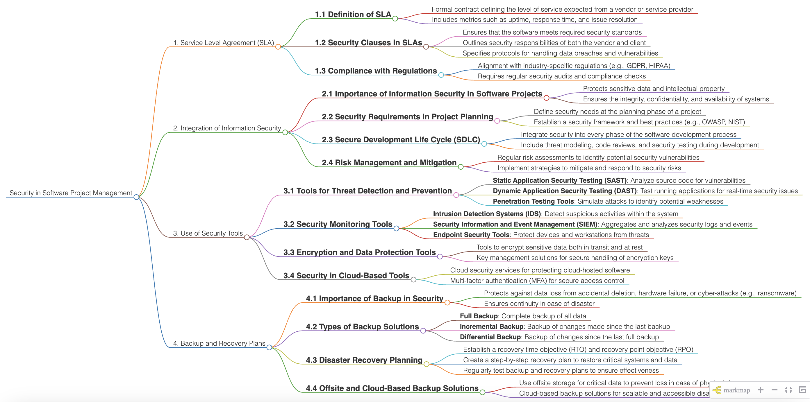

# Security in Software Project Management

  

Security in Software Project Management refers to the application of practices, tools, and strategies to ensure the protection of data, systems, and processes throughout the lifecycle of a software project. This involves safeguarding sensitive information, ensuring compliance with regulations, mitigating risks, and embedding robust security protocols into every phase of project management, from planning and development to deployment and maintenance.

### 1. Service Level Agreement (SLA)
SLAs play a critical role in defining security standards for software projects. They set clear expectations between service providers and clients, ensuring that responsibilities are well-delineated and standards are consistently met.
- **1.1 Definition of SLA:**
  - A formal agreement specifying the expected level of service from a vendor or provider.
  - Includes benchmarks like uptime, response time, and resolution time for issues.
  - Serves as a foundation for mutual accountability, providing a basis for evaluating performance and addressing disputes.
  - Offers clarity on escalation procedures, ensuring swift resolution of service-related problems.
- **1.2 Security Clauses in SLAs:**
  - Guarantees that software adheres to necessary security standards, safeguarding against vulnerabilities.
  - Specifies the security obligations of both the vendor and the client, fostering a collaborative approach to risk management.
  - Details protocols for handling data breaches and addressing vulnerabilities, emphasizing transparency and accountability.
  - May include penalties or incentives tied to compliance, encouraging strict adherence to security benchmarks.
- **1.3 Compliance with Regulations:**
  - Ensures alignment with regulations such as GDPR or HIPAA, which are critical for protecting sensitive data and maintaining user trust.
  - Requires routine security audits and adherence to compliance checks to preemptively address potential issues.
  - Encourages documentation of compliance efforts, offering a clear audit trail for regulatory bodies.
  - Aligns operational practices with global security standards, making software projects more robust and trustworthy.

### 2. Integration of Information Security
This section focuses on embedding security into every phase of the software lifecycle, ensuring a proactive approach to safeguarding data and systems.
- **2.1 Importance of Information Security in Software Projects:**
  - Safeguards sensitive data and intellectual property from threats such as cyberattacks and unauthorized access.
  - Maintains the integrity, confidentiality, and availability of systems, which is essential for business continuity.
  - Enhances stakeholder confidence by demonstrating a strong commitment to data protection and risk mitigation.
  - Supports compliance with legal and ethical standards, reducing liability risks for organizations.
- **2.2 Security Requirements in Project Planning:**
  - Identifies security needs early in the planning phase, allowing for efficient resource allocation and risk assessment.
  - Implements a security framework based on standards like OWASP and NIST, providing a structured approach to safeguarding data.
  - Encourages the inclusion of security experts in the planning team to address complex challenges effectively.
  - Promotes a culture of security awareness, ensuring that all stakeholders prioritize risk management.
- **2.3 Secure Development Life Cycle (SDLC):**
  - Ensures security practices are integrated into each phase of development, from initial planning to deployment.
  - Involves threat modeling, code reviews, and rigorous security testing to address vulnerabilities proactively.
  - Facilitates continuous improvement through regular feedback loops and security assessments.
  - Reduces the likelihood of costly security breaches, protecting both organizational reputation and user data.
- **2.4 Risk Management and Mitigation:**
  - Conducts regular risk assessments to identify vulnerabilities and prioritize mitigation efforts.
  - Develops strategies to mitigate risks and respond effectively to security threats, ensuring resilience in the face of challenges.
  - Leverages tools and methodologies like risk matrices and impact analysis to make informed decisions.
  - Encourages ongoing training and capacity building to keep teams prepared for emerging threats.

### 3. Use of Security Tools
This branch highlights tools that strengthen software security, offering practical solutions to enhance defenses against a variety of threats.
- **3.1 Tools for Threat Detection and Prevention:**
  - **Static Application Security Testing (SAST):** Examines source code for vulnerabilities, identifying issues early in development.
  - **Dynamic Application Security Testing (DAST):** Monitors live applications for security flaws, providing real-time insights.
  - **Penetration Testing Tools:** Simulates real-world attacks to uncover weaknesses, allowing teams to address issues proactively.
  - **Vulnerability Scanners:** Automates the identification of known vulnerabilities, streamlining the process of risk management.
- **3.2 Security Monitoring Tools:**
  - **Intrusion Detection Systems (IDS):** Identifies suspicious activities within the system, offering early warnings of potential breaches.
  - **Security Information and Event Management (SIEM):** Analyzes logs and aggregates security events, providing a holistic view of system health.
  - **Endpoint Security Tools:** Secures devices and workstations from threats, ensuring comprehensive protection across the network.
  - **Behavioral Analytics Tools:** Tracks unusual user or system behavior to detect potential insider threats.
- **3.3 Encryption and Data Protection Tools:**
  - Encrypts sensitive data during transmission and storage, ensuring confidentiality and security.
  - Provides secure key management solutions to protect encryption keys from unauthorized access.
  - Implements advanced algorithms like AES and RSA to safeguard critical information.
  - Enables compliance with data protection regulations, reducing the risk of penalties.
- **3.4 Security in Cloud-Based Tools:**
  - Uses cloud-based security measures for hosted software, ensuring robust protection of data and applications.
  - Incorporates multi-factor authentication (MFA) for improved access control, adding an extra layer of security.
  - Employs cloud-native tools like identity management services to streamline user authentication.
  - Facilitates real-time monitoring and response to threats, ensuring system resilience.

### 4. Backup and Recovery Plans
This section ensures data preservation and rapid recovery in case of incidents, reducing downtime and mitigating risks.
- **4.1 Importance of Backup in Security:**
  - Protects against data loss from deletion, hardware issues, or cyberattacks like ransomware, ensuring operational continuity.
  - Ensures business continuity during disruptions, safeguarding against potential revenue loss.
  - Encourages the use of redundant storage systems to enhance reliability and minimize risks.
  - Builds trust with stakeholders by demonstrating a commitment to data protection and resilience.
- **4.2 Types of Backup Solutions:**
  - **Full Backup:** Captures a complete copy of all data, providing a reliable baseline for recovery efforts.
  - **Incremental Backup:** Saves only the changes made since the last backup, optimizing storage space.
  - **Differential Backup:** Tracks changes made since the last full backup, striking a balance between speed and storage efficiency.
  - **Continuous Data Protection (CDP):** Offers real-time data backup, ensuring minimal data loss in the event of a disaster.
- **4.3 Disaster Recovery Planning:**
  - Establishes recovery time objectives (RTO) and recovery point objectives (RPO) to set clear expectations for recovery.
  - Develops a detailed plan for restoring critical systems and data, ensuring rapid resumption of operations.
  - Regularly tests recovery strategies to verify effectiveness and identify areas for improvement.
  - Leverages cloud-based solutions for flexible and scalable disaster recovery.
- **4.4 Offsite and Cloud-Based Backup Solutions:**
  - Stores critical data offsite to prevent loss due to physical damage, enhancing disaster preparedness.
  - Implements cloud-based backups for scalable and accessible recovery solutions, ensuring flexibility.
  - Utilizes geographically distributed storage to protect against regional disasters.
  - Facilitates seamless integration with existing systems, reducing complexity and downtime.

## Contribution 🛠️
Please create an [Issue](https://github.com/drshahizan/project-management/issues) for any improvements, suggestions or errors in the content.

